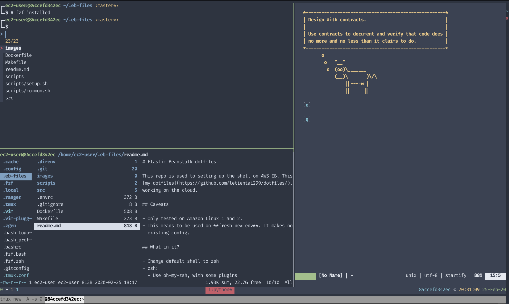

# Elastic Beanstalk dotfiles

This repo is used to setting up a comfortable working env on AWS EB. This used
some of my [my dotfiles](https://github.com/letientai299/dotfiles/), trimmed
down for working on the cloud.

## What's inside?



- Change default shell to zsh.
- zsh:
  - Use [zgen][gh_zgen] to manage zsh plugins.
  - Install some plugins from [oh-my-zsh][gh_omz] and [other
    complestion](./src/zsh/zgenconfig).
- vim:
  - Use [vim-plug][gh_vim_plug] to manage plugin.
  - Add [some wellknown plugins](./src/vim/vimrc)
- tmux:
  - Install from source version 3.0a
  - Add a theme and [some plugins](./src/tmux/tmux.conf) to make working with
    it easier.
- Others:
  - git
  - [fzf][gh_fzf] for fuzzy searching files and command history.
  - [ranger][gh_ranger] for qhicly managing files in the shell
  - [direnv][gh_direnv] for project-based env configuration. This come with
    some 2 functions `export_function`, `export_alias`, which can be used to
    create project based function and alias. (Copied and modified from
    [here][gh_direnv_export])

## Install

**! Besure to read the scripts before executing !**

**! This will destroy your existing dotfiles. Again, this means to be used on
Beanstalk container and disposable EC2 instance !**

```sh
bash < <(curl -s -S -L https://raw.githubusercontent.com/letientai299/eb-dotfiles/master/scripts/install.sh)
```

## Caveats

- Only tested on Amazon Linux 1 and 2. This might works on Centos, but I've not
  tested yet.
- This means to be used on **fresh new env**. It makes no effort to backup the
  existing config.

## Contributions

Feel free to submit pull requests to help:

- Fix errors
- Update docs
- Make this work with more systems.
- Reduce instalation time

<!-- ref -->

[gh_zgen]: https://github.com/tarjoilija/zgen
[gh_omz]: https://github.com/robbyrussell/oh-my-zsh
[gh_ranger]: https://github.com/ranger/ranger
[gh_vim_plug]: https://github.com/junegunn/vim-plug
[gh_fzf]: https://github.com/junegunn/fzf
[gh_direnv]: https://github.com/direnv/direnv
[gh_direnv_export]: https://github.com/direnv/direnv/issues/73
